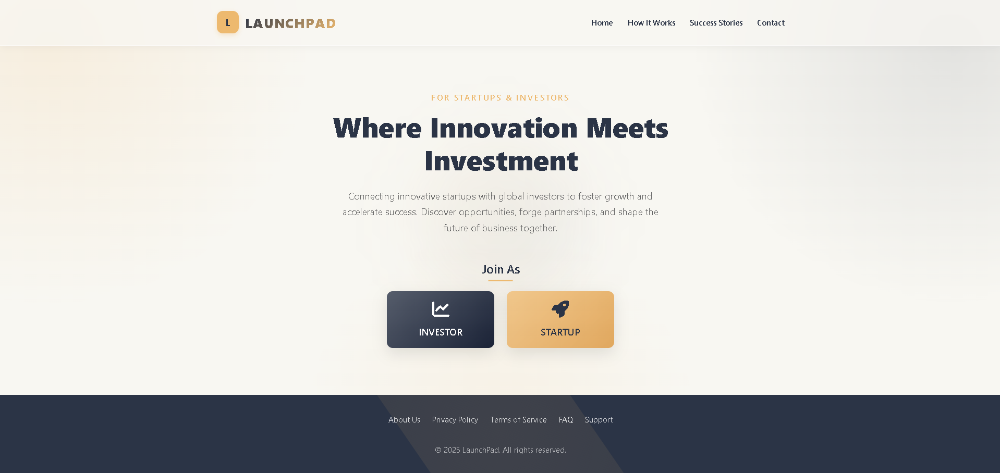
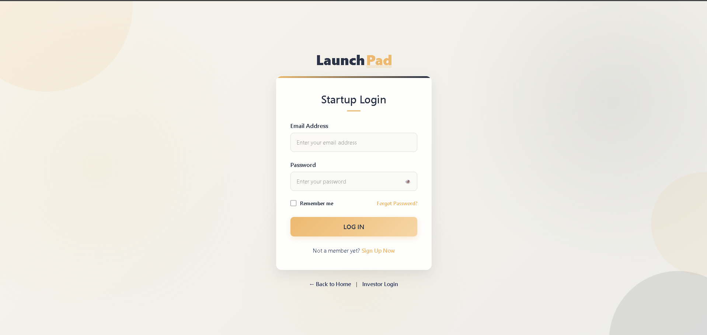
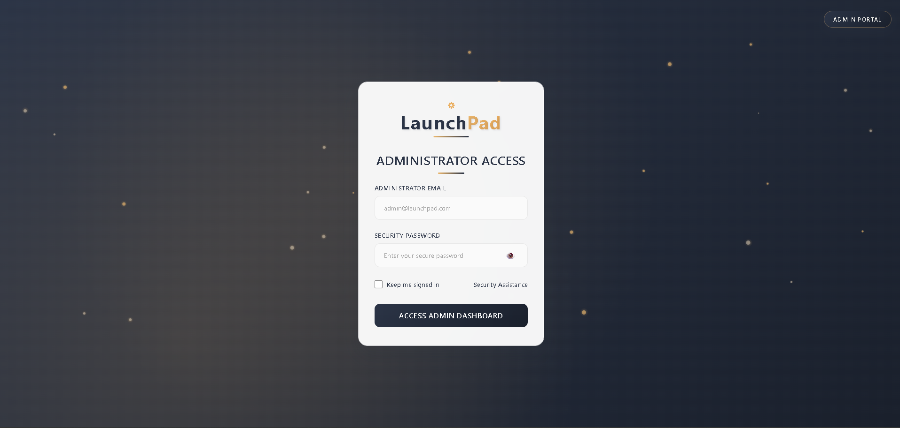
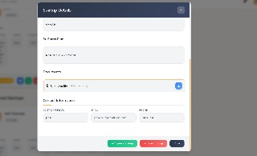
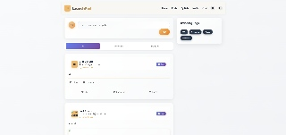
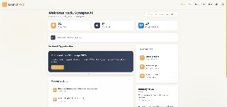
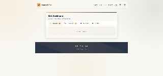
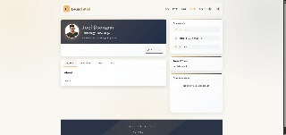
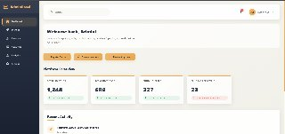
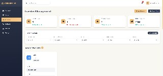

# Launchpad

Launchpad is a Startup and Investor Platform designed to bridge the gap between innovative startups and potential investors. It provides a secure, interactive environment for pitching ideas, bidding on projects, and real-time communication.

## Features

- **Dual Portals**: Dedicated interfaces and dashboards for both Startups and Investors.
- **Admin Dashboard**: Centralized management panel for administrators to oversee platform activity.
- **Real-Time Chat**: Integrated messaging system using WebSockets for live communication between startups and investors.
- **Project Bidding & Posts**: Startups can post their project requirements, and investors can place bids.
- **Secure Authentication**: Protected endpoints and sessions using JSON Web Tokens (JWT) and Spring Security.
- **File Uploads**: Supports secure file and document uploads (e.g., pitch decks, profiles).
- **Email Notifications**: Integrated with SMTP to send out automated emails and alerts.

## Technology Stack

- **Backend**: Java (JDK 14), Spring Boot, Spring Security, Spring Data MongoDB, Spring WebSockets.
- **Database**: MongoDB (NoSQL).
- **Frontend**: HTML5, CSS3, Vanilla JavaScript.
- **Build Tool**: Maven.

## Primary Pages & Navigation

The frontend is composed of several static HTML pages served directly by the backend:
- **Main Landing Page**: `index.html`
- **Startup Area**: `startup_login.html`, `startup_reg_pg.html`, `startup_index.html`, `startup_profile.html`, `startup_post.html`, `startup_bids.html`, `startup_chat.html`
- **Investor Area**: `investor_login.html`, `investor_reg_pg.html`, `investors_index.html`, `investors_profile.html`, `investors_posts.html`, `investors_bids.html`, `investors_chat.html`
- **Admin Panel**: `adminlogin.html`, `admindashboard.html`

## Prerequisites

Before running the application, make sure you have the following installed on your machine:

- **Java Development Kit (JDK) 14 or higher**
- **Maven** (Required if you are running the project from the command line)
- **MongoDB** (Must be running locally on the default port `27017`)

## How to Run the Project

### Option 1: Using IntelliJ IDEA (Recommended)
1. Open IntelliJ IDEA.
2. Go to **File > Open** and select the `untitled` folder (which contains the `pom.xml` file) inside the `LAUNCHPAD` directory.
3. Wait for IntelliJ to index the project and download all Maven dependencies.
4. Ensure your local MongoDB server is running.
5. Locate the main application class (the one annotated with `@SpringBootApplication`) in `src/main/java` and run it.
6. Open your web browser and navigate to: `http://localhost:8080/index.html`

### Option 2: Using the Command Line
1. Ensure your local MongoDB server is running.
2. Open your terminal or command prompt.
3. Navigate to the directory containing the `pom.xml` file:
   ```bash
   cd path/to/LAUNCHPAD/untitled
   ```
4. Run the Spring Boot application using Maven:
   ```bash
   mvn spring-boot:run
   ```
5. Once the backend has fully started, open your web browser and navigate to: `http://localhost:8080/index.html`

## Configuration

The primary configuration file is located at `src/main/resources/application.properties`. Here you can customize:
- **MongoDB Database**: Defaults to `mongodb://localhost:27017/launchpad_db`
- **Server Port**: Defaults to `8080`
- **Mail Settings**: SMTP configuration for sending emails (Requires updating username/password to work).
- **File Upload Directory**: Configured to upload files to an `uploads` directory.

## Troubleshooting

- **MongoDB Connection Error**: If the application crashes on startup with a connection error, verify that MongoDB is installed and running on `localhost:27017`.
- **Port 8080 is already in use**: If another application is using port 8080, the backend will fail to start. You can resolve this by changing `server.port=8080` to another port in `application.properties`.
- **Maven is not recognized**: If running via CLI throws an error about `mvn`, ensure you have Maven installed and added to your system's `PATH` environment variable.

---

## 📸 Screenshots & Walkthrough

Here is a look at the various features and interfaces of the Launchpad platform:

### Landing Page & Authentication




### Platform Overviews & Dashboards


### Additional Interfaces







